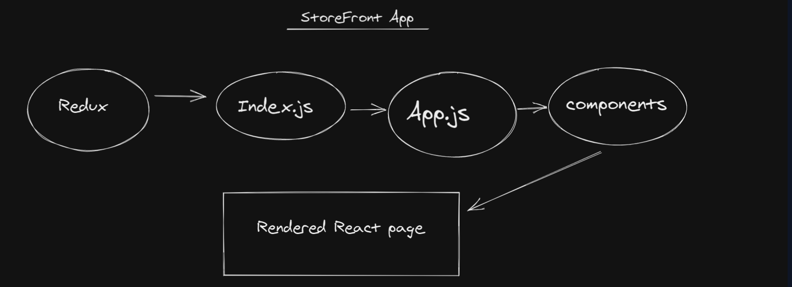

# Virtual Store
## An online shopping portal for a fictional store

 ## Author :
 
 ### Dima Alabsi

-------------------------
### Description :
#### Our application will power an online storefront that will allow our users to browse our product offerings by category, place items in their shopping cart, and check-out when they are ready to make their purchas

-------
The application will be created with the following overall architecture and methodologies

React
ES6 Classes
Redux Store for Application State
Deployed API with Mongo storage for storing categories and products
Superagent or Axios for performing API Requests
Material UI for layout and styling
Test Driven Development, using Jest
Deployment to a cloud provider (Netlify, Amplify, or GitHub Pages)

[URL Page using gh-pages](https://dimaalabsi.github.io/storefront/)

 [redux pull request](https://github.com/DimaAlabsi/storefront/pull/1)

  [combined-reducers pull request](https://github.com/DimaAlabsi/storefront/pull/2)